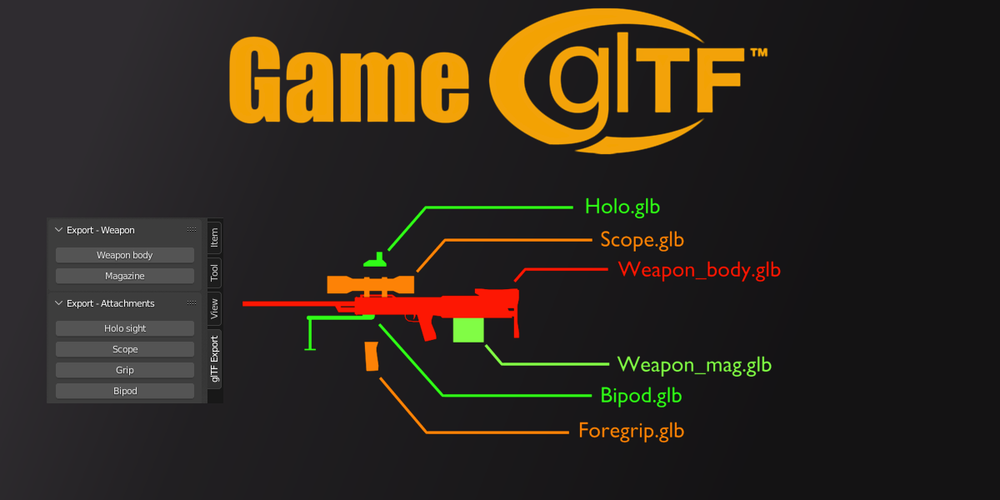

# Requirements
1. Blender 3.0 or higher
2. Basic python / programming knowledge

# Data supported
This addon is still a work in progress, current data types supported:
Type | Support
:---: | :---:
Animation | <t style="color:red">0.2.0</t>
Scene | <t style="color:green">Yes</t>
Node (Object) | <t style="color:green">Yes</t>
Mesh | <t style="color:green">Yes</t>
Skin (Armature) | <t style="color:green">Yes</t>
Material | <t style="color:orange">No (mesh materials slots still work)</t>
Texture | <t style="color:red">No</t>
Image | <t style="color:red">No</t>
Camera | <t style="color:red">No</t>
Light |  <t style="color:red">No</t>

# What is the purpose of this addon?
This addon is highly specialised in exporting assets into game engines using glTF file format. It achieves it by giving the user access to a library that does most of the heavy lifting and a very fast way to create buttons that can run export code minimising time between exporting and seeing new changes within the game engine.

Have a look at the features section below to see if it fits your purpose, if you do not need any of this functionality I highly advise you to stick to the default glTF exporter.

# Features
* Additive workflow, start with nothing and add what you need.

* Break down your complex scene into smaller files.

* No scenes required, making it possible to create asset libraries (for example file containing meshes).

* Easily add hierarchies, collections or singular objects.

* Exclude objects with regular expressions, without being forced to delete them before exporting.

* Non-destructively merge multiple meshes into one.

* Add as many UV maps, vertex colors or shape keys to your meshes as you need.

* Strip bones based on blacklists or filters.
  
* Automate excluding useless control bones and trimming bone prefixes when using rigify armatures.

* Easily make your scripts into buttons.

# Limitations
* Cannot export base meshes, each mesh has to be assigned to an object in scene in order to be exported.
